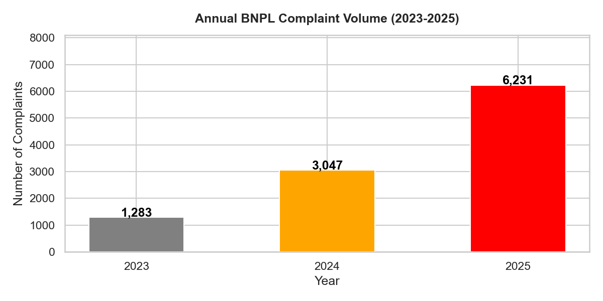
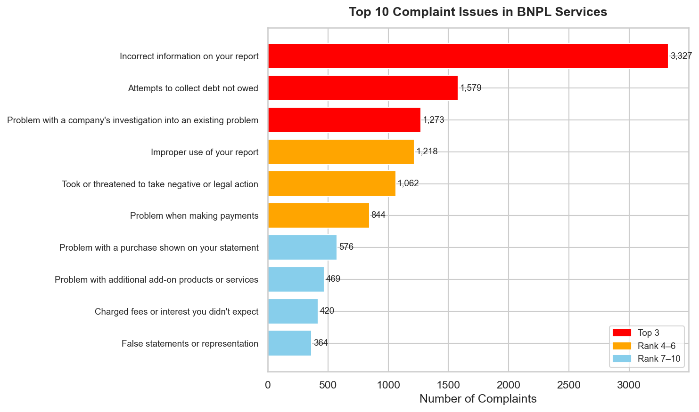
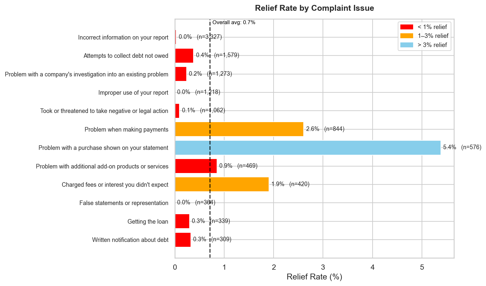
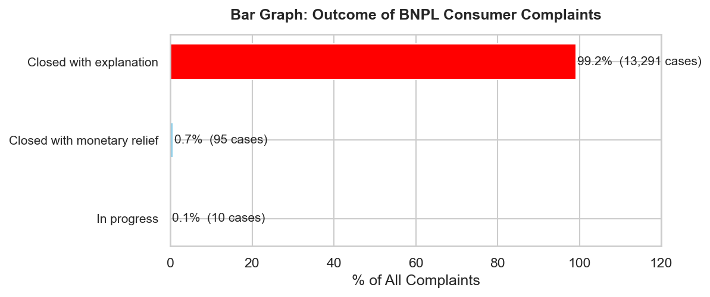
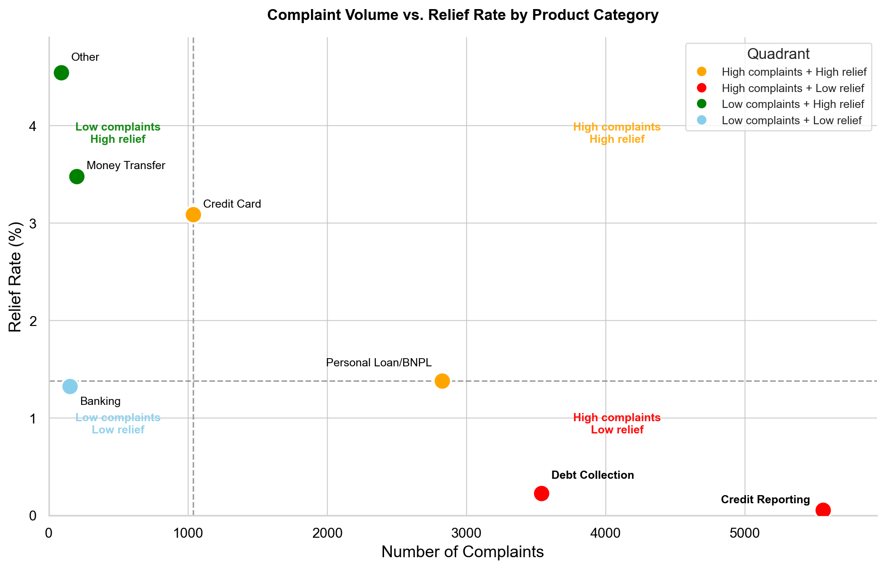

## Overview

This page documents the exploratory data analysis of the 13,396 BNPL complaints filed
against Affirm and Klarna. Four questions guide the analysis:

1. How has complaint volume changed over time?
2. What issues are consumers complaining about?
3. How often do companies provide substantive relief?
4. Which product categories concentrate the most harm?

## Complaint Volume Is Accelerating

Complaint volume rose from 1,283 in 2023 to 3,047 in 2024, and further to 6,231 in 2025 —
an increase of nearly double every year.

{#fig-volume width=80% fig-align="center"}

This trajectory substantially outpaces the growth in BNPL loan originations reported by
the CFPB over the same period [@cfpb2025b], suggesting that consumer harm is increasing
faster than the underlying market.

## Top Complaint Issues

The single most common issue — "Incorrect information on your report" — accounts for 3,327
complaints, or approximately 25% of the entire dataset.

{#fig-top-issues width=90% fig-align="center"}

All four of the most common categories relate to credit reporting:

1. Inaccurate information
2. Debt collection overreach
3. Investigation failures
4. Improper use of credit files

Taken together, these four categories account for **more than half (52%)** of all
complaints filed.

This pattern is a direct consequence of the TILA exemption. Because BNPL transactions are
not subject to the dispute resolution requirements that apply to credit cards under
Regulation Z, consumers have no federally guaranteed mechanism to correct errors in how
BNPL activity is reported to credit bureaus. The CFPB has noted that BNPL lenders'
reporting practices are highly inconsistent — some furnish data to credit bureaus and some
do not — creating an opaque system in which consumers cannot know in advance how a BNPL
transaction will affect their credit profile [@cfpb2022].

## Near-Complete Absence of Relief

Of the 13,396 complaints in the dataset, 13,291 (99.2%) were closed with "explanation
only", meaning the company acknowledged the complaint but provided no monetary or
non-monetary remedy. Only 95 complaints (0.7%) resulted in any form of actual relief.

{#fig-relief-rate width=80% fig-align="center"}

{#fig-outcome width=80% fig-align="center"}

Disaggregating by issue type makes the pattern even starker:

| Complaint Issue | N | Relief Rate |
|:----|---:|---:|
| Incorrect information on your report | 3,327 | 0.03% |
| Improper use of your report | 1,218 | 0.0% |
| False statements or representation | 364 | 0.0% |

This pattern reveals a systematic disconnect between **formal responsiveness** (companies
replied to 99.9% of complaints) and **substantive accountability** (companies resolve
almost none of them). Under the existing voluntary complaint response framework, consumers
have no legally enforceable right to dispute resolution — a protection that credit card
users enjoy under TILA's Fair Credit Billing provisions.

## Quadrant Analysis: Volume vs. Relief

Plotting each product category along two dimensions simultaneously — complaint volume
(x-axis) and relief rate (y-axis) — reveals where harm concentrates.

{#fig-quadrant width=85% fig-align="center"}

**Credit Reporting** and **Debt Collection** occupy the most problematic quadrant: high
complaints, low relief. Credit Reporting alone accounts for over 5,200 complaints while
carrying a near-zero relief rate of approximately 0.1%. Debt Collection follows a similar
pattern at roughly 3,500 complaints and 0.2% relief. These two categories together
represent the dominant harm profile in the BNPL complaint.

Personal Loan/BNPL sits at the boundary between quadrants, with approximately 2,800
complaints and a 1.4% relief rate that places it just above the median relief threshold.
While technically classified as "High complaints + High relief" by the median cutoff, this
categorization is misleading: a 1.4% relief rate means that for every 100 BNPL consumers
who file a complaint, fewer than two receive any substantive resolution.
