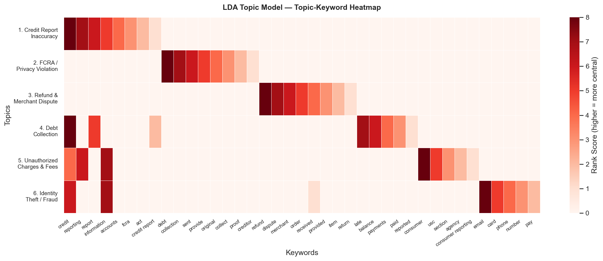

## Overview

This page applies Latent Dirichlet Allocation (LDA) topic modeling to the corpus of 4,791
consumer complaint narratives. Topic modeling surfaces latent themes without requiring
pre-specified categories, providing an unsupervised check on the patterns identified in
the exploratory and TF-IDF analyses.

## Method

LDA models each document as a mixture of topics and each topic as a distribution over
words. Six topics were estimated after evaluating coherence scores for $k \in \{4, 5, 6,
7, 8\}$. Preprocessing mirrored the TF-IDF pipeline (lowercase, stopword removal,
minimum document frequency of 5). The model was fit with scikit-learn using default
hyperparameters.

## Six Latent Topics

The six topics and their top keywords:

| # | Topic | Representative Keywords |
|:---|:------|:------------------------|
| 1 | Credit Report Inaccuracy | credit, reporting, report, information, accounts |
| 2 | FCRA / Privacy Violation | fcra, act, credit report, data, privacy |
| 3 | Refund and Merchant Dispute | order, refund, merchant, purchase, received |
| 4 | Debt Collection | debt, collect, collector, creditor, owe |
| 5 | Unauthorized Charges and Fees | late, fees, balance, charges, consumer |
| 6 | Identity Theft and Fraud | fraud, theft, unauthorized, identity, account |

{#fig-lda width=90% fig-align="center"}

## Interpretation

### Two Dominant Topics

The two largest topics by average weight are **Credit Report Inaccuracy** (Topic 1) and
**FCRA / Privacy Violation** (Topic 2). This confirms at the topic-model level the pattern
identified through both the EDA and the TF-IDF analysis: a plurality of BNPL consumer
harm manifests as credit reporting errors that the current framework is not designed to
resolve.

### Identity Theft as a Distinct Topic

The presence of a distinct identity theft topic (Topic 6) is consistent with the CFPB's
finding that BNPL's soft-pull underwriting model creates heightened exposure to account
opening fraud [@cfpb2022]. Because BNPL providers typically do not perform hard credit
checks and offer near-instant approval, fraudulent accounts can be opened in a consumer's
name with minimal friction.

### Unauthorized Charges and Fees

Topic 5 (Unauthorized Charges and Fees) maps directly onto the disclosure-related
complaints identified in the EDA: consumers encountering charges they did not expect
because those charges were never clearly disclosed. Late fees, in particular, are often
disclosed only in a lengthy terms-of-service document that consumers do not see at the
checkout flow.

### Refund and Merchant Disputes

Topic 3 is the territory where companies actually do sometimes provide relief (as shown
in the TF-IDF resolved/unresolved comparison). When the consumer's problem is a failed
delivery, a defective product, or a billing error on a single transaction, Affirm and
Klarna can sometimes resolve the issue internally. The problem is that this is a small
share of the complaint corpus.

## Cross-Validation of Findings

The three analytical methods — EDA, TF-IDF, and LDA — converge on the same core finding:

| Method | Dominant Finding |
|:-------|:-----------------|
| EDA | 52% of complaints relate to credit reporting |
| TF-IDF | Unresolved complaints dominated by "credit," "report" |
| LDA | Two largest topics are credit reporting + FCRA |

This convergence strengthens the conclusion that the BNPL regulatory gap produces a
specific, identifiable, and quantifiable form of consumer harm: systematic credit
reporting errors that the current framework provides no mechanism to correct.
