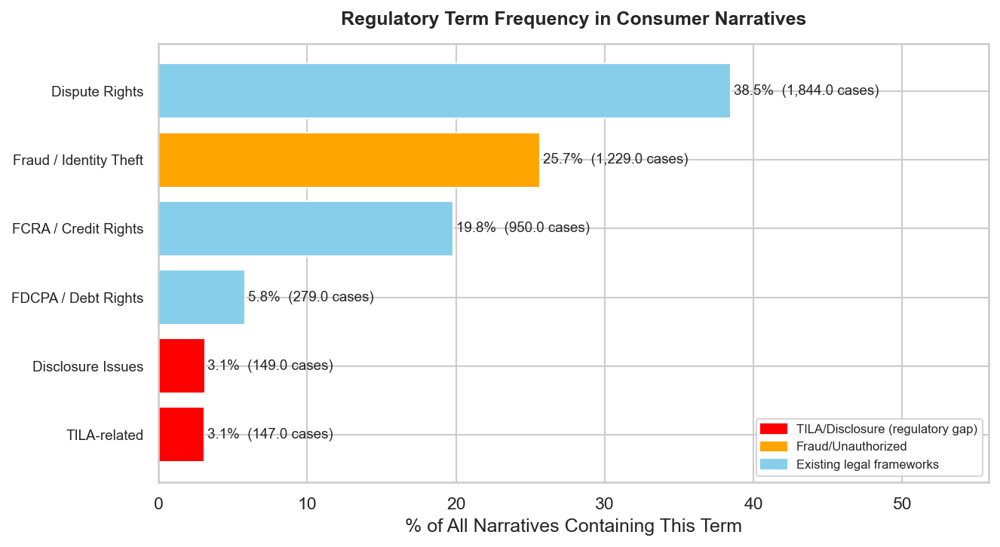

## Overview

This page quantifies how often consumers invoke specific regulatory concepts in their
complaint narratives. The analysis maps consumer language onto existing legal frameworks
to reveal which rights consumers know they have — and which they do not.

## Method

Each narrative (n=4,791) was scanned for terms associated with five regulatory concept
categories:

| Category | Example Terms |
|:---------|:--------------|
| Dispute Rights | dispute, challenge, investigation |
| Fraud / Identity Theft | fraud, identity theft, unauthorized |
| FCRA / Credit Rights | FCRA, credit bureau, credit reporting |
| FDCPA / Debt Rights | FDCPA, debt collection, validation |
| TILA-related (Disclosure) | APR, finance charge, annual percentage rate |

Each narrative was counted once per category if any of that category's terms appeared.

## Findings

{#fig-regulatory-terms width=85% fig-align="center"}

| Regulatory Concept | Cases | % of Narratives |
|:-------------------|------:|----------------:|
| Dispute Rights | 1,844 | 38.5% |
| Fraud / Identity Theft | 1,229 | 25.7% |
| FCRA / Credit Rights | 950 | 19.8% |
| FDCPA / Debt Rights | 279 | 5.8% |
| Disclosure Issues | 149 | 3.1% |
| **TILA-related** | **147** | **3.1%** |

## Silence Is Not Satisfaction

The low invocation rate of TILA-related terms (3.1%) could be misread as evidence that
consumers are satisfied with BNPL disclosures. The opposite interpretation is more
consistent with the evidence.

Consumers know they have rights under the FCRA because credit reporting disputes are
established legal terrain, with decades of case law, consumer-facing educational materials,
and a widely understood mechanism for submitting disputes to credit bureaus. They do not
invoke TILA because, for BNPL products, **TILA does not apply**. Consumers cannot assert
rights they do not have.

The low frequency of TILA-related terms is not evidence of consumer satisfaction with
BNPL disclosures; it is evidence that the legal framework for asserting those rights does
not exist.

## The Asymmetry of Legal Literacy

The data reveal a form of asymmetry worth making explicit. Consumers routinely use the
vocabulary of rights they have:

- "Dispute" (38.5%) — FCBA and FCRA territory
- "FCRA" and "credit bureau" (19.8%) — established federal law
- "Fraud" and "identity theft" (25.7%) — protected under multiple federal statutes

They do not use the vocabulary of rights they lack for BNPL, even though those same
concepts would apply to the same transactions if they had been made on a credit card:

- "APR" (part of the 3.1%)
- "Finance charge" (part of the 3.1%)
- "Annual percentage rate" (part of the 3.1%)

This is not a linguistic coincidence. It is the empirical footprint of a regulatory gap.
