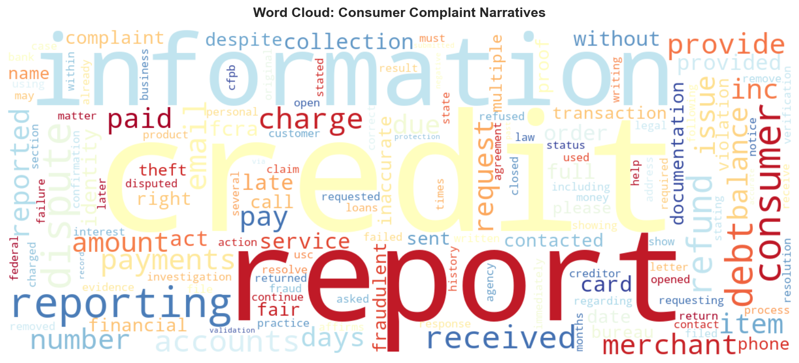
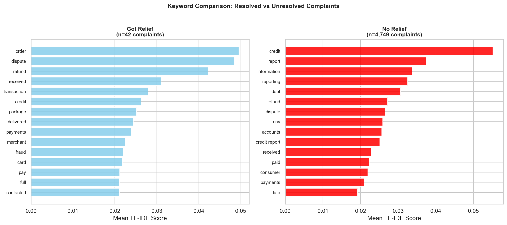

## Overview

This page presents the Term Frequency–Inverse Document Frequency (TF-IDF) analysis of
4,791 consumer complaint narratives. The analysis identifies which words best distinguish
complaints and compares the keyword profiles of resolved versus unresolved complaints.

## Method

TF-IDF vectorization assigns each word a score based on:

- How often it appears in a single complaint (term frequency)
- How rare it is across the entire corpus (inverse document frequency)

Words with high TF-IDF scores are those that are distinctive to particular complaints
rather than common throughout. This helps surface the specific harms consumers describe.

Preprocessing steps:

- Lowercase conversion
- Removal of stopwords (standard English stopword list)
- Removal of digits and non-alphabetic tokens
- Minimum document frequency of 5

## Overall Corpus Word Cloud

The dominant terms — "credit," "report," "debt," "dispute," "refund" — confirm the
findings from the exploratory analysis: BNPL consumers are not primarily describing
product dissatisfaction but legal and financial harm.

{#fig-wordcloud width=80% fig-align="center"}

The prevalence of "dispute" and "report" as core lexical anchors is particularly
significant, as these are precisely the mechanisms — dispute resolution and credit
reporting — that TILA governs for credit card users but does not mandate for BNPL.

## Resolved vs. Unresolved Complaints

Comparing keyword profiles between complaints that received relief (n=95) and those that
did not (n=4,696) reveals a stark structural pattern.

{#fig-keyword-comparison width=90% fig-align="center"}

### Resolved (n=95)

Complaints that resulted in relief are characterized by:

- `order`
- `dispute`
- `refund`
- `transaction`
- `delivered`
- `package`

These describe **discrete transactional disputes** — individual purchases where a
merchant-level issue can be resolved internally by the company.

### Unresolved (n=4,696)

Complaints that received no relief are dominated by:

- `credit`
- `report`
- `information`
- `debt`
- `accounts`
- `credit report`

These describe **systemic credit reporting errors** — problems that require correction
by credit bureaus, not merely the BNPL company.

## Interpretation

This divergence reveals the structural limits of the current complaint resolution
framework. Companies can occasionally resolve discrete transactional disputes because the
remedy is within their direct control: refund the consumer, reverse the charge, resolve
the delivery problem. They cannot — and are not legally required to — correct systemic
credit reporting errors that propagate across bureaus.

The complaints that receive no relief are precisely those that a TILA-mandated dispute
resolution mechanism would address. Under the Fair Credit Billing Act, credit card issuers
are legally obligated to investigate disputes within a defined timeline. BNPL providers
face no equivalent requirement.
